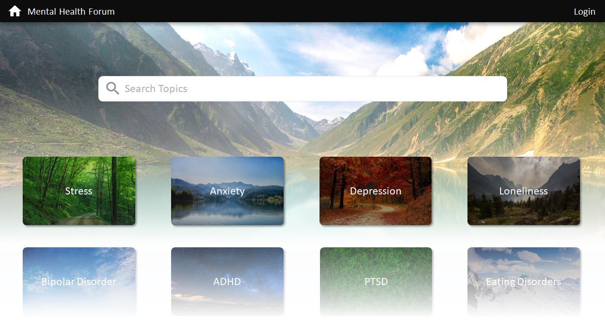
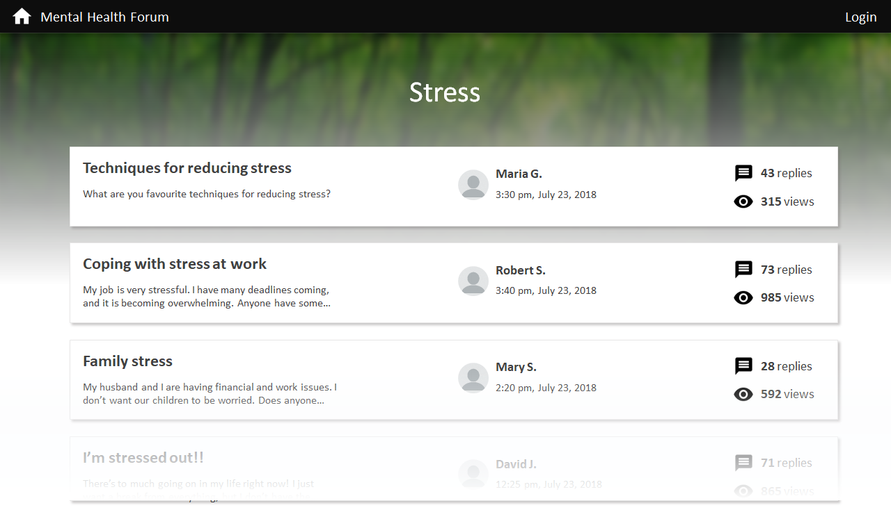
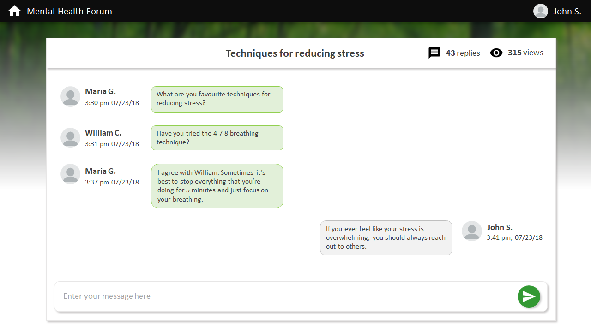
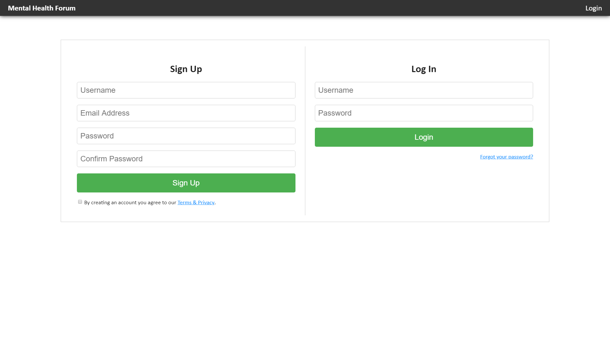

This project has adopted the [Microsoft Open Source Code of Conduct](https://opensource.microsoft.com/codeofconduct/). For more information see the [Code of Conduct FAQ](https://opensource.microsoft.com/codeofconduct/faq/) or contact [opencode@microsoft.com](mailto:opencode@microsoft.com) with any additional questions or comments.

# Project Setup

To set up and run the application, please follow the procedures outlined in the following subsections:

## Cloning the project

1. Clone the repository to your local machine:

   ```
   git clone https://github.com/Microsoft/MentalHealthPlatform.git
   ```

## Setting up the database

1.  Download and install MongoDB from the MongoDB website:
  
    https://docs.mongodb.com/manual/installation/

2. If using a Windows machine, one may need to add mongo to the environment variables. The instructions regarding the addition of environment variables can be found in the Microsoft Docs article for installing and configuring MongoDB:

    https://docs.microsoft.com/en-us/azure/virtual-machines/windows/install-mongodb

3.  After installing MongoDB, launch the MongoDB terminal by using the following command:
  
    ```
    mongo
    ```

4.  To add sample data, enter the commands listed in the **"docs/database_ commands.txt"** file of this repository

## Setting up the server

1.  In the cloned project, navigate to the **server** directory:

    ```
    cd server
    ```

2.  Install the dependencies:

    ```
    npm install
    ```

3.  Run the server:

    ```
    node server.js
    ```
    
    The console should then print a statement about the server running on a certain port:

    > Server is running on Port 3000...

## Setting up the client

1.  In the cloned project, navigate to the **client** directory:

    ```
    cd client
    ```

2.  Install all dependencies:

    ```
    npm install
    ```

## Running the project

1.  Run the client:

    ```
    npm start
    ```

    The console should then print a statement with a URL in which the application is running.

    For example:

    > Project is running at http://localhost:8080/

2.  Launch the application in a web browser by navigating to the URL printed by the console

# Pages

## Topics Page

The Topics page will act as the home page of the application.

This page will consist of a search header and topics grid. The topics grid will list a variety of mental health topics (ex. stress, anxiety, depression). When the user clicks on a topic, they will be directed to a Forum page for that topic.

The Topics component hierarchy can be found in [Component Hierarchies](./docs/COMPONENT_HIERARCHIES.md).

The Topics page should be reachable via direct URL or by the user clicking on the application title link in the global navigation bar.



## Forum Page

The Forum page will display a table of chats relevant to the topic of the forum. When the user clicks on a chat, they will be directed to a Chat page.

The Forum component hierarchy can be found in [Component Hierarchies](./docs/COMPONENT_HIERARCHIES.md).

The Forum page should be reachable via direct URL or by the user clicking on a Forum link within the topics table in the Topics page.



## Chat Page

The Chat page will display a table of posts relevant to the chat.

The Chat component hierarchy can be found in [Component Hierarchies](./docs/COMPONENT_HIERARCHIES.md).

The Chat page should be reachable via direct URL or by the user clicking on a Chat link within the forum table in the Forum page.



## Signup/Login Page

The Signup/Login page will display two panes: a Signup page, and a Login pane.

The Signup/Login page should be reachable via direct URL or by the user clicking the Login link in the global navigation bar.

